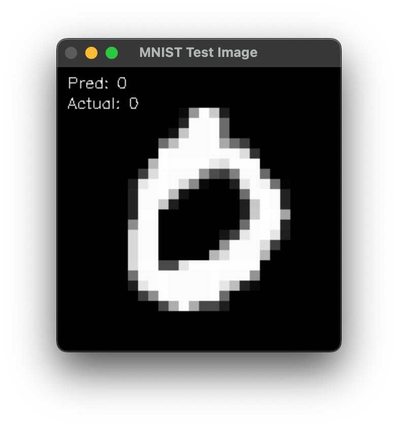
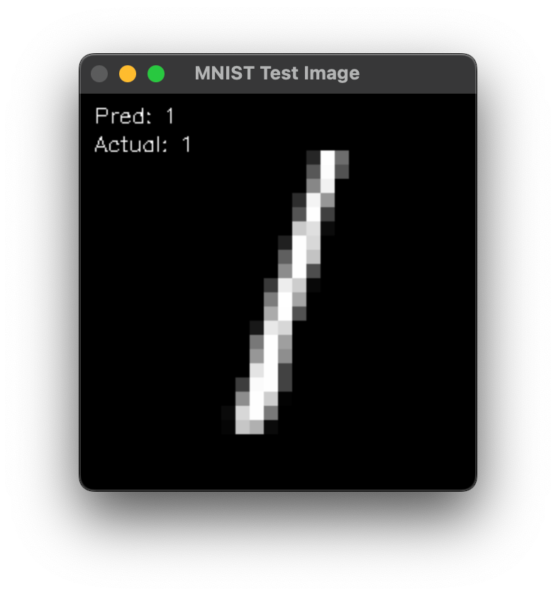
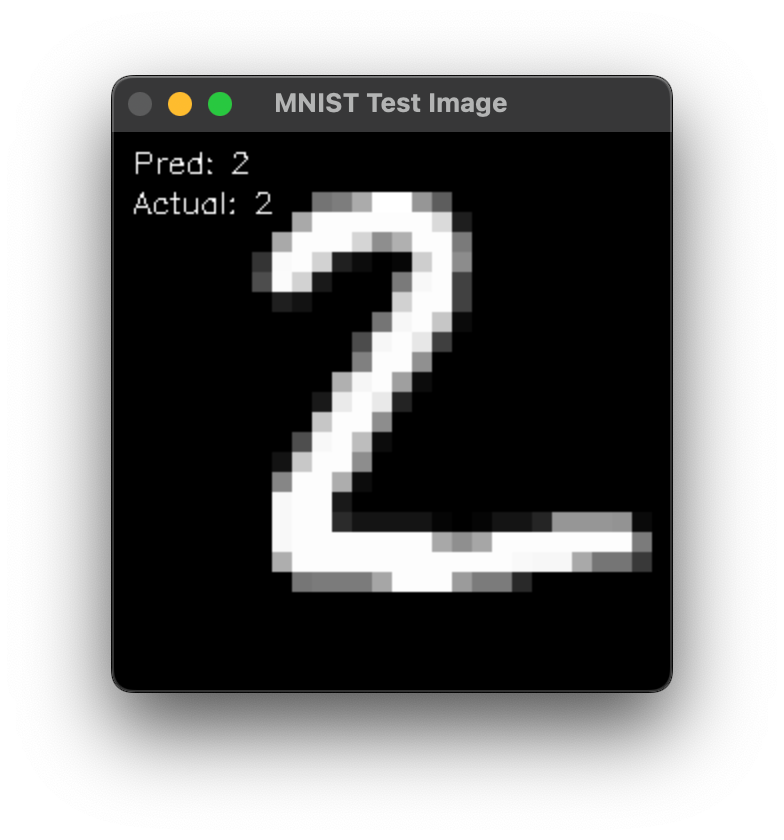
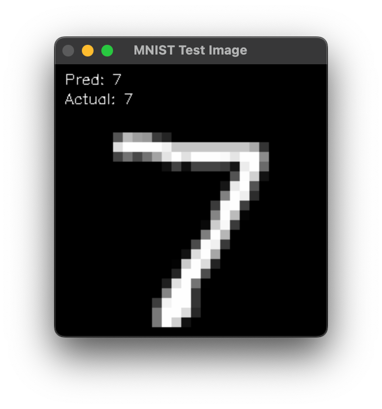

# Digit Recognition using Convolutional Neural Networks

## Introduction

This project is a digit recognition system using Convolutional Neural Networks (CNN). The system is trained on the MNIST dataset which is a dataset of 60,000 28x28 grayscale images of the 10 digits, along with a test set of 10,000 images. The system is trained using libtorch and opencv.

## Requirements

- CMake
- OpenCV
- libtorch

- Mnist dataset can be downloaded from [here](http://yann.lecun.com/exdb/mnist/)
- Extract the dataset and place it in the resources folder
- Put the training images in the resources/train folder
- Put the test images in the resources/test folder

## Usage

1. Clone the repository
2. Run the following commands to build the project

```bash
mkdir build
cd build
cmake ..
make
```

3. Run the following command to train the model

```bash
./digit_recognition train
```

4. Run the following command to test the model

```bash
./digit_recognition test
```

## Results

The model was trained for 10 epochs and achieved an accuracy of 98.5% on the test set.

|  |  |
| :----------------: | :----------------: |
|  |  |
